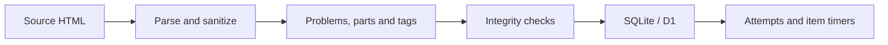
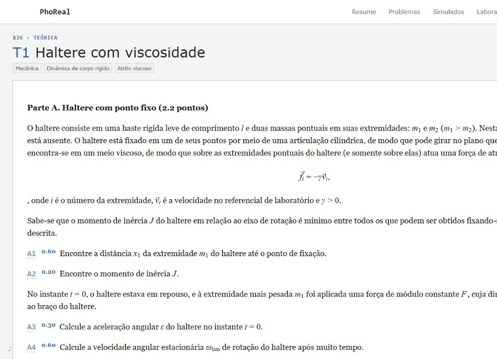

# PhoReal

Physics olympiad training built around a structured problem corpus, import validation and persistent timing per problem item.

[Browse problems](https://phoreal.s4m256.workers.dev/problemas#taiwan) · [Reproducible corpus report](docs/CORPUS.md)

<!-- corpus-summary:start -->
**Public XY snapshot:** 18 exams · 165 problems · 2,200 part records · 233 tags. 164 public statements; 1 requires source authentication. The reproducible report checks unique IDs/source URLs and relational integrity.
<!-- corpus-summary:end -->





*Anonymous problem view, captured 2026-09-19. This viewport crop demonstrates statement rendering and item structure; it does not show authenticated timing.*

## What it does

PhoReal connects physics problem statements to a training record: attempts, reading time, repeated work on individual items, and explicit completion. The counts above are generated from the checked-in source snapshot, not live usage; part records include hierarchy and are not independent questions.

The anonymous catalog and problem pages are public. Personal timing and AI hints remain separate authenticated capabilities and are not required for browsing.

## Technical highlights

- **Source-aware ingestion:** the [parser](lib/phors/parser.mjs) and [database layer](lib/phors/database.mjs) retain source IDs, URLs, hashes, parts and tags rather than flattening a problem into one text field.
- **Import integrity:** [importer tests](tests/phors-importer.test.mjs) exercise parsing and database behavior; the [catalog validator](scripts/validate-phors-catalog.mjs) checks uniqueness, orphan relations, sanitization and retained images/text.
- **Per-item training:** the [schema](db/schema.ts) stores intervals separately from completion; [tests](tests/training-core.test.mjs) cover repeated intervals, discarding an active interval and owner-scoped records.
- **Rendering checks:** [math tests](tests/statement-math.test.mjs) cover TeX repairs and units, with separate tests for headings and image routing. They do not certify every translated statement as mathematically exact.
- **Persistence and migration:** Drizzle/D1 migrations separate the imported catalog from personal records; [migration verification](scripts/validate-phors-site-data.mjs) checks round trips and preservation of existing attempts when the source SQLite database is available.

## Verification

Node.js 22.13 or newer is required. From a fresh clone:

```bash
node scripts/corpus-report.mjs --check
npm ci
npm test
npm run test:hints
npm run lint
```

`npm test` runs Taiwan collection validation, a production build, and the rendering/import/training suite. The standalone report checks the public JSON snapshot without credentials or dependencies.

`npm run validate:phors` and `npm run validate:site-data` additionally require `data/phors-full.sqlite`, which is **not included** in the public checkout. Do not interpret the JSON report as a replacement for those full checks. `npm run phors:sync:full` accesses external source pages to build a source database and depends on their availability.

## Development

```bash
npm run dev
npm run build
```

The public deployment uses the existing Vinext/Vite Worker and Cloudflare D1 architecture. The deploy script builds and publishes the Worker through Wrangler.

## Content and limitations

XY problems originate from [pho.rs](https://xy.pho.rs/); their authorship is not PhoReal's. Taiwan materials are a separate collection and are not included in the XY totals above. Translation and AI hints require their own review; neither is an authoritative replacement for the source or official marking scheme.
